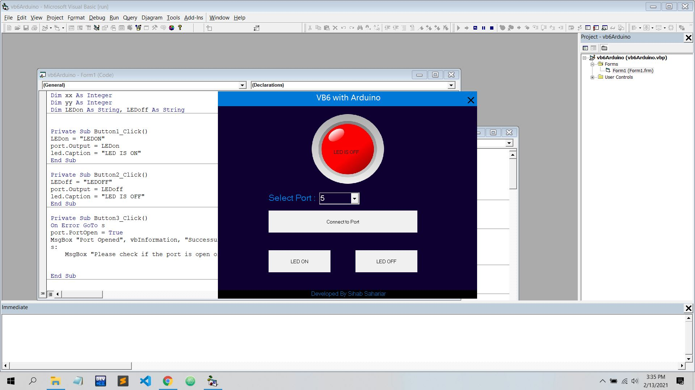

# VB6-With-Arduino
A GUI App developed in VB6 to work with Arduino.
Screen Shot:

Information:
- Programming Language: VB
- Compiler: VB6

Features:
- Very Easy Interface 
- Port Selection 
- Light Weight 
- Fully open source & free.
